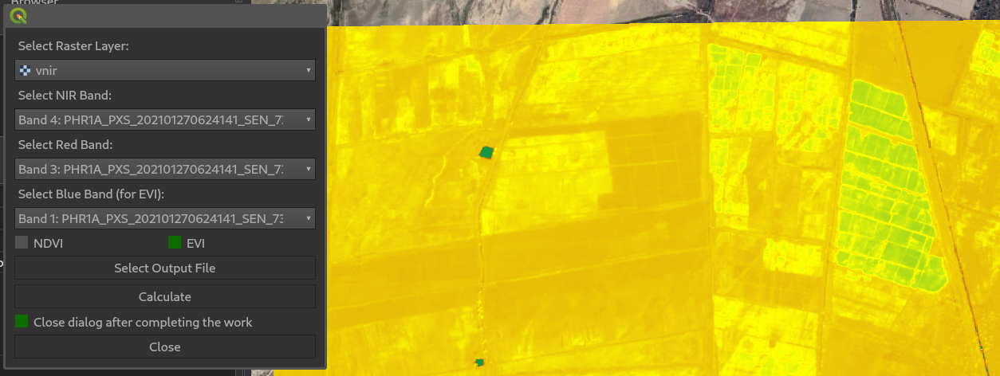

# GDAL Image Processing Environment
Basic working QGIS Plugin

It uses GDAL Calc to process NDVI or EVI in the background and displays them with colour ramps

TO make it work in QGIS:

1 - Download all the files in a GIPEL directory
2 - zip gipe.zip GIPE/
3 - in QGIS=>Plugins=> Install from zip, select the zip file
4 - Make sure the plugin is selected, it will appear in QGIS=>Plugins menu
